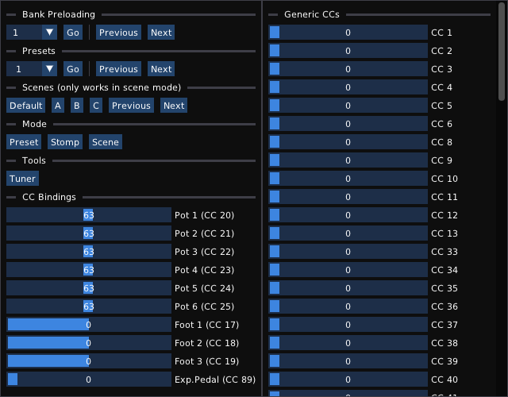

# Anagram MIDI Control

This repository contains a **developer tool** meant to ease development and testing of Anagram MIDI features.  
It is not intended for end-users and as such there is absolutely no support here of any kind.  
The tool is open-source because nothing here is proprietary or hidden knowledge, just a little UI to send MIDI events when you click buttons.

Behind the scenes it uses [DPF](https://github.com/DISTRHO/DPF/) and [ImGui](https://github.com/ocornut/imgui/) through [DPF-Widgets](https://github.com/DISTRHO/DPF-Widgets/).  
It can both be run as standalone (which will send MIDI to all available ports) or as a plugin contained in a host.

Building requires CMake and UI uses OpenGLES2 for rendering.  
There are no other dependencies, though do note DPF is used as a git submodule, so building requires cloning the repository recursively.

